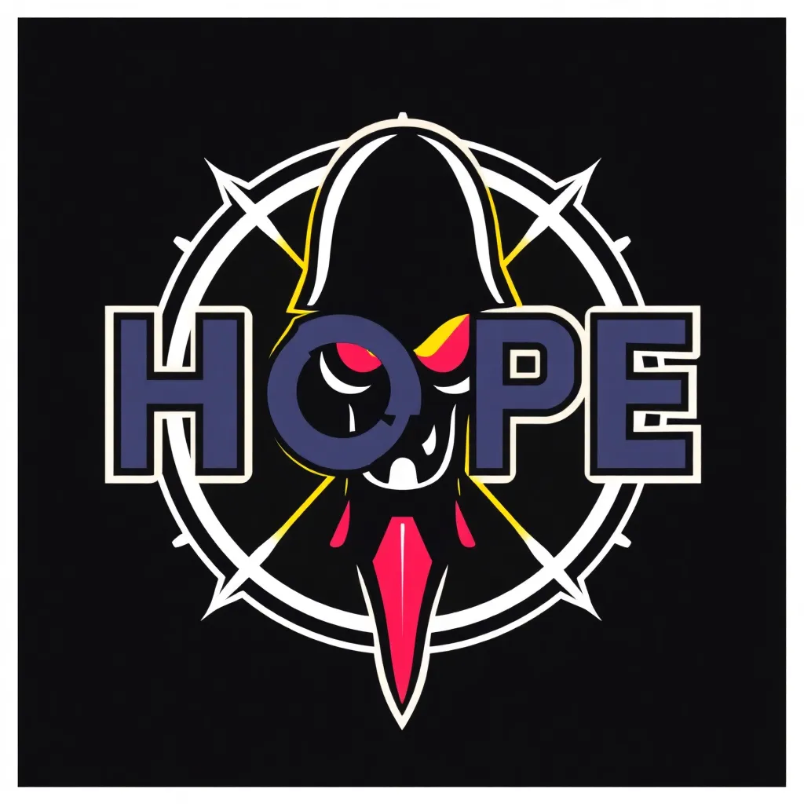

# MedicalAI Assistant



An AI-powered medical assistant web application that helps with diagnosing diseases, recommending treatments, and providing medical research information.

## Features

### Core Features
- **Symptom Analysis**: Analyze symptoms and get possible diagnoses
- **Treatment Information**: Get information about treatment options for medical conditions
- **Medical Research**: Access the latest research information about diseases
- **Document Repository**: Upload and process medical documents to enhance AI knowledge

### Advanced Features
- **Data Visualization**: Generate visual representations of medical data
- **Multiple AI Providers**: Support for OpenAI, Cohere, Google AI, and BlackboxAI models
- **User Authentication**: Secure account creation and management
- **Image Analysis**: AI-assisted analysis of medical images with enhancement options
- **Voice Interface**: Speak to the AI and listen to responses
- **Collaborative Consultations**: Real-time messaging between patients and healthcare providers

## Setup

### Requirements
- Python 3.9 or higher
- Flask web framework
- Various AI and language processing libraries

### Installation

1. Clone the repository
2. Install dependencies:
   ```
   pip install -r requirements.txt
   ```
3. Set up environment variables in a `.env` file:
   ```
   FLASK_SECRET_KEY=your_secret_key
   OPENAI_API_KEY=your_openai_key
   COHERE_API_KEY=your_cohere_key
   GOOGLE_API_KEY=your_google_key
   ```
4. Run the application:
   ```
   python app.py
   ```

### BlackboxAI Standalone Server (Optional)
The application includes a BlackboxAI integration directly in the Python backend. However, if you prefer to run BlackboxAI as a separate service, a Node.js server is provided:

1. Install Node.js dependencies:
   ```
   npm install
   ```
2. Run the BlackboxAI server:
   ```
   node blackbox_server.js
   ```
3. The BlackboxAI server will run on port 3000 by default.

## Usage

### Authentication
- Register a new account as a patient, doctor, or specialist
- Log in to access the application features
- Manage your profile and password from the user menu

### AI Assistant
- Describe symptoms to get possible diagnoses
- Enter a medical condition to learn about treatment options
- Research diseases to get the latest information
- Optionally include visualizations with your requests
- Choose between different AI providers: OpenAI, Cohere, Google, or BlackboxAI

### Document Repository
- Upload medical documents (PDF, DOCX, TXT) to enhance the AI's knowledge
- View all uploaded documents

### Image Analysis
- Upload medical images for AI-assisted analysis
- Apply various enhancements to improve image quality
- Receive AI interpretation of image metrics

### Voice Interface
- Record voice input to describe symptoms or ask questions
- Process transcriptions for different types of analysis
- Listen to AI responses through speech synthesis

### Consultations
- Create or join consultation sessions
- Exchange real-time messages with healthcare providers
- Share images and files during consultations
- View participant information and session history

### Visualizations
- Generate visualizations of symptoms, treatments, and disease progression
- Save visualizations for future reference
- View gallery of saved visualizations

## Technical Architecture

### Backend
- **Flask**: Web framework
- **LangChain**: Integration with multiple AI providers
- **Flask-Login**: User authentication
- **Pillow/OpenCV**: Image processing
- **SQLite/JSON**: Data storage

### Frontend
- **Bootstrap**: UI framework
- **JavaScript**: Dynamic interactions
- **Plotly**: Interactive data visualizations

### AI Providers
- **OpenAI**: GPT models (requires API key)
- **Cohere**: Command models (requires API key)
- **Google**: Gemini models (requires API key)
- **BlackboxAI**: Various AI models including GPT-4o, Claude, Gemini, and BlackboxAI's own model (no API key required)

## Medical Disclaimer

This application provides information for educational purposes only and is not a substitute for professional medical advice, diagnosis, or treatment. Always consult with qualified healthcare providers for medical concerns.

## Important Disclaimer

This application is for **educational purposes only** and is not a substitute for professional medical advice, diagnosis, or treatment. Always seek the advice of your physician or other qualified health provider with any questions you may have regarding a medical condition.

## Setup Instructions

### Prerequisites

- Python 3.8 or higher
- pip (Python package installer)

### Installation

1. Clone this repository
```
git clone <repository-url>
cd medicalai-assistant
```

2. Create a virtual environment (recommended)
```
python -m venv venv
```

3. Activate the virtual environment
   - Windows:
   ```
   venv\Scripts\activate
   ```
   - macOS/Linux:
   ```
   source venv/bin/activate
   ```

4. Install dependencies
```
pip install -r requirements.txt
```

5. Set up environment variables by editing the `.env` file:
   - Add your API keys to the `.env` file:
   ```
   OPENAI_API_KEY=your_openai_api_key_here
   COHERE_API_KEY=your_cohere_api_key_here
   GOOGLE_API_KEY=your_google_api_key_here
   ```
   Note: BlackboxAI doesn't require an API key as it uses the free version.

### Running the Application

1. Start the Flask development server
```
flask run
```

2. Open your web browser and navigate to:
```
http://127.0.0.1:5000
```

## Usage

1. **Selecting an AI Provider**: Choose between OpenAI, Cohere, Google Gemini, or BlackboxAI models
2. **Symptom Analysis**: Enter your symptoms in detail in the symptom analysis section and click "Analyze Symptoms"
3. **Treatment Information**: Enter a medical condition in the treatment information section and click "Get Treatment Info"
4. **Medical Research**: Enter a disease name in the medical research section and click "Research Disease"

## Supported AI Providers

- **OpenAI**: Uses GPT-4 or GPT-3.5-Turbo models
- **Cohere**: Uses Command models for natural language tasks
- **Google**: Uses Gemini models for comprehensive analysis
- **BlackboxAI**: Uses multiple models including GPT-4o, Claude Sonnet 3.5, Gemini Pro, and BlackboxAI's own model

## Technical Details

- **Backend**: Flask (Python)
- **Frontend**: HTML, CSS, JavaScript, Bootstrap
- **AI Models**: 
  - OpenAI GPT models (via LangChain)
  - Cohere Command models (via LangChain)
  - Google Gemini models (via LangChain)
  - BlackboxAI models (via direct API integration)

## License

This project is for educational purposes only.

## Author


**uncoder-cloud**

- Email: webdayskenya@gmail.com
- WhatsApp: +254791258754
- Instagram: phantom0x01 